# deltarune-ua

Українська локалізація гри [Deltarune](https://deltarune.com/). Переклад є особливим тому, що робиться українцями. Ви не зустрінете в діалогах машинного перекладу — **лише живий!** Наш переклад перефразовує англомовні жарти на зрозумілі для українців, тому вам не буде нудно проходити гру.

    
Приклади перекладу:

    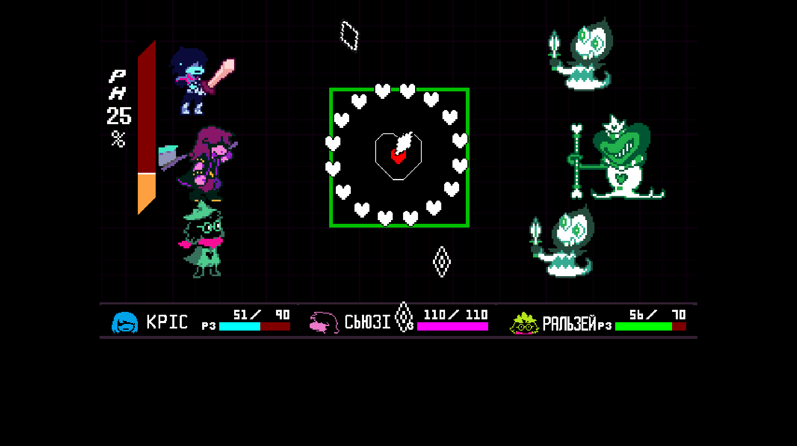
    
    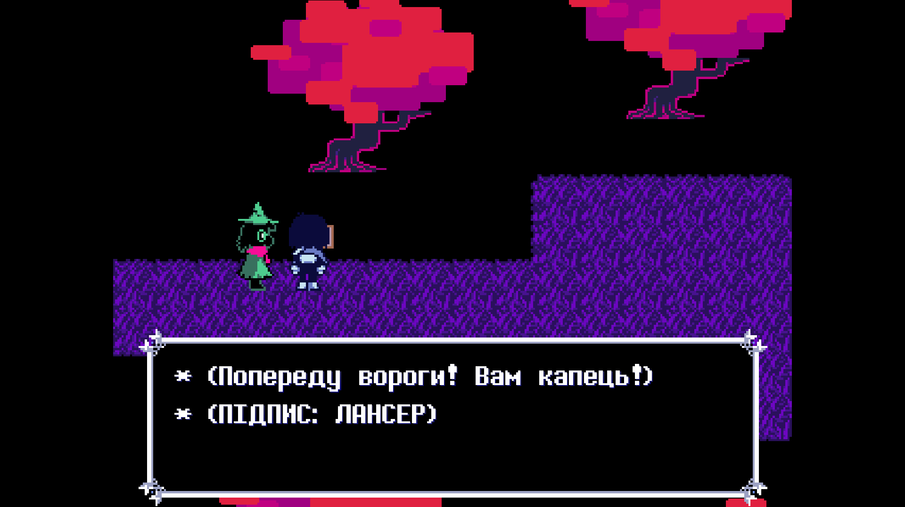
    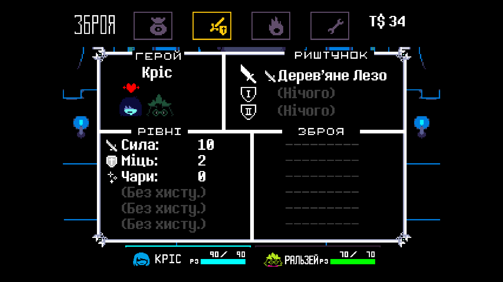
    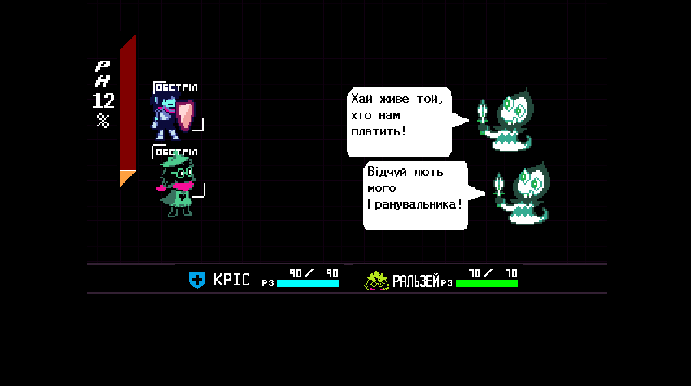
    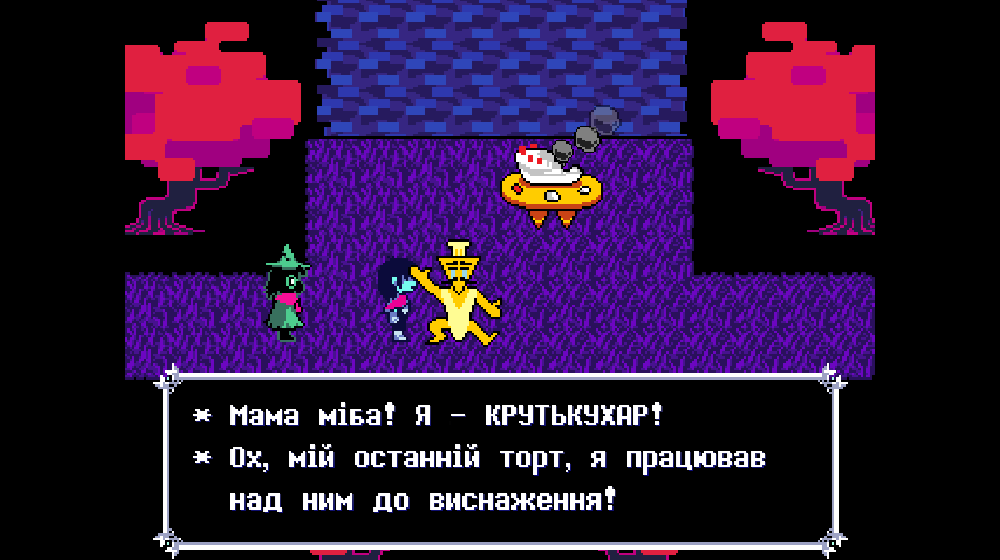
    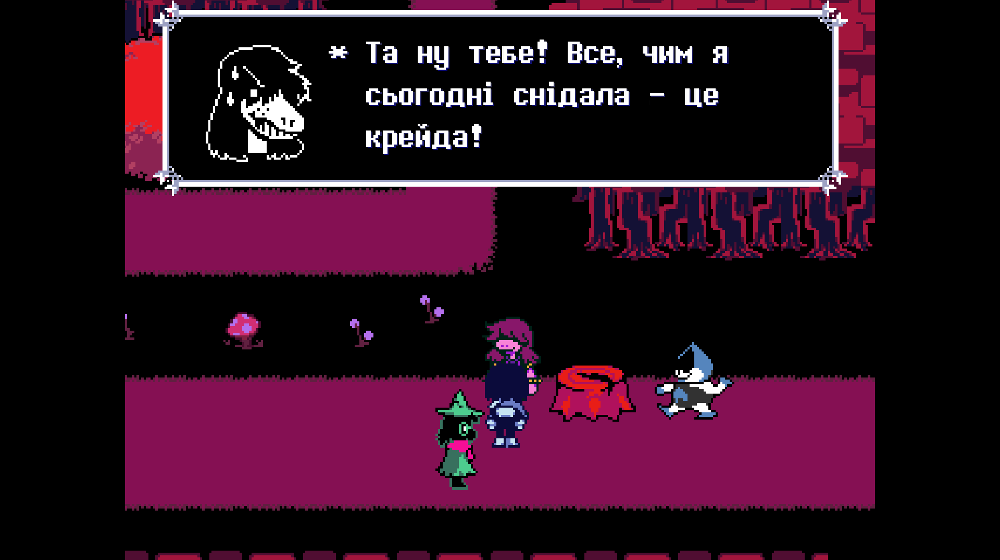
    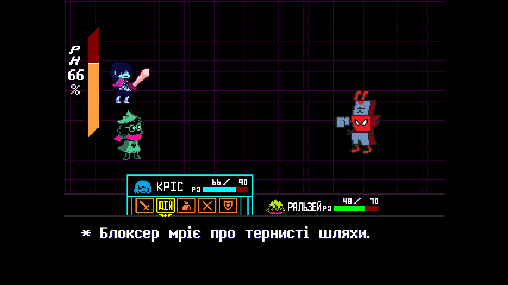
    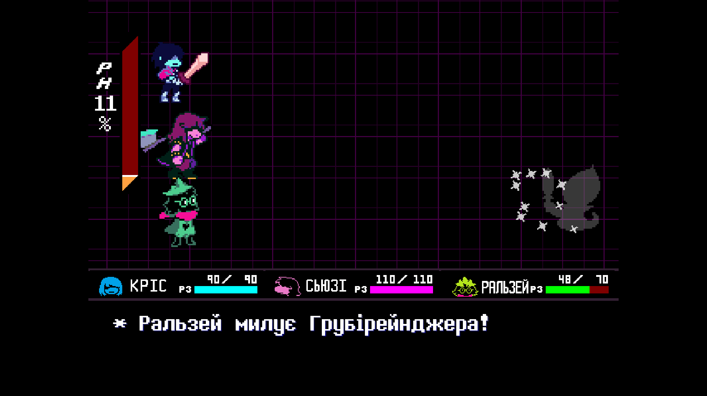
    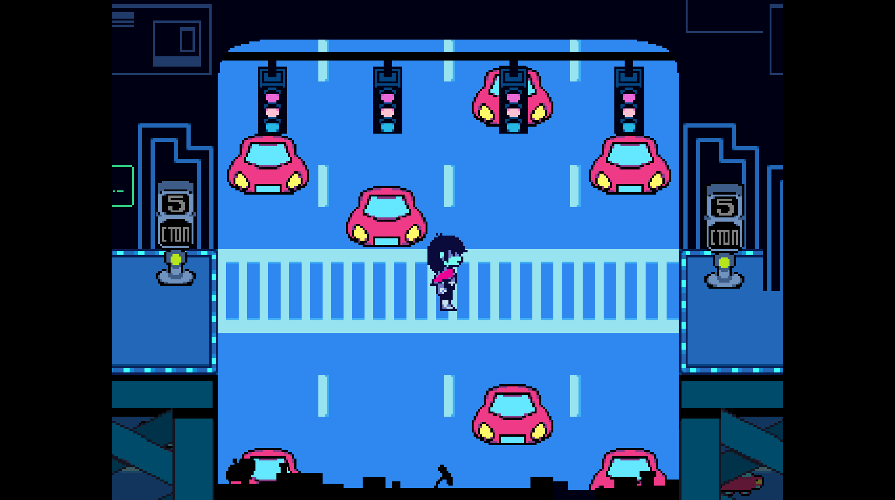
    
    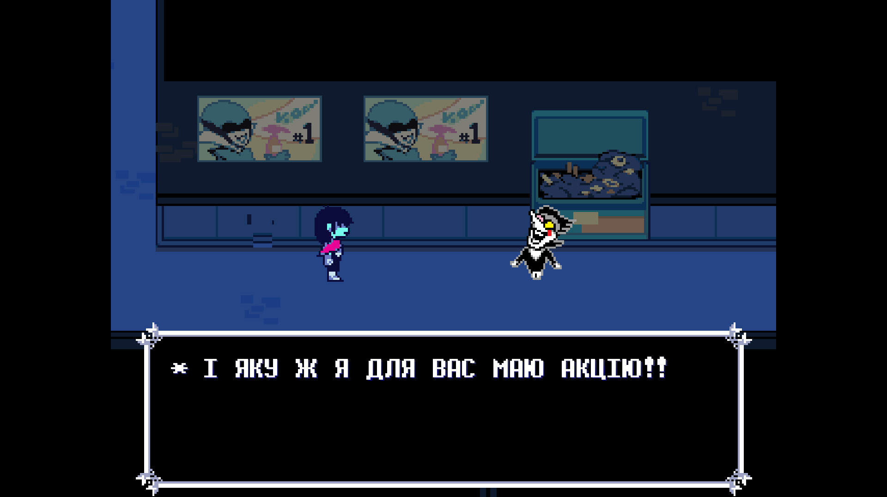
    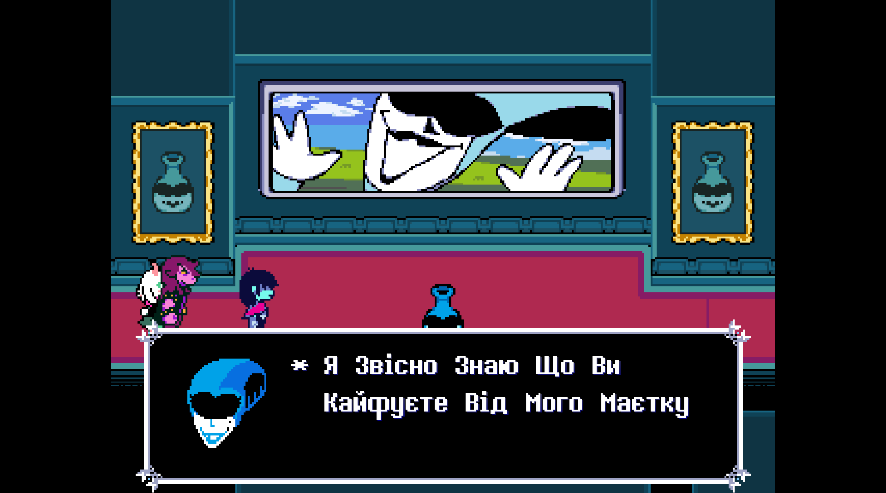
    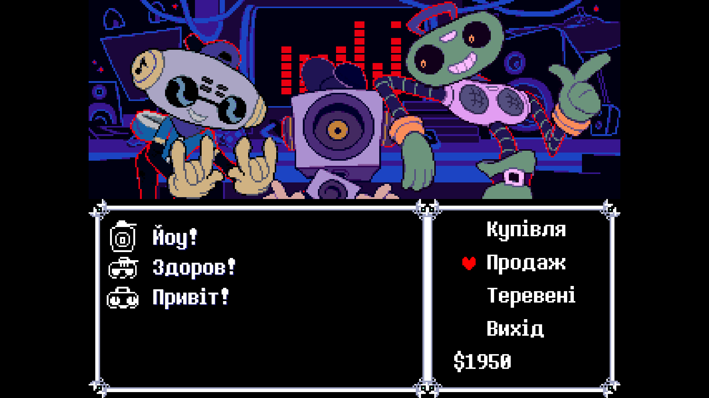

## Прогрес перекладу

### Розділ 1: 100%
(Ігровий текст, намальований текст, озвучення).
 Порт на Android: [100%]

    
Детальніше про озвучення

     Голос Джиявола (https://youtu.be/LrTNVlcmk0M) та вокальний уривок “Не забудь” (ориг. “Dont Forget”) (https://youtu.be/EWDl1gN0-c8).

### Розділ 2: 100%
Ігровий текст: [100%]
 Перевірки (штуки десь три мінімум): [100%]
 Намальований текст: [100%]
 Код: [100%]
 Озвучення: [100%]
 Порт на Android: [100%]

    
Детальніше про озвучення

     Пісня до титрів (“До зустрічі” - ремікс “Не забудь” з 1 роз.), всі три теми персонажа Spamton, кнопки клавіатури в пазлах, Диспетчерка Завдацьок та звуки "РАУНД 1/2/3!" і "В БІЙ!".

### Трейлер
https://github.com/yanchukcha/deltarune-ua/assets/83290351/932e30af-a491-4bbf-bcfb-ce1ca638fff6

## Deltarune
**P.S**: Якщо ви стримите або нумограєте гру з нашою українізацією, просимо вас вказати авторів перекладу та/або оригінальних творців гри нижче.
  
(**UKR**) Автор гри/Власник прав на гру: Тобі Фокс (**ENG**) Copyright/Deltarune Author: TobyFox
  
(**UKR**) Оригінальні образи та графіка: [Теммі Чанґ](https://twitter.com/tuyoki) та [Kanotynes](https://twitter.com/kanotynes) (**ENG**) Original Art Designers: [Temmie Chang](https://twitter.com/tuyoki) & [Kanotynes](https://twitter.com/kanotynes)
  [Саму гру можна безплатно встановити з офіційних джерел, які можна знайти за цим посиланням.](https://deltarune.com/)

**Також ми маємо свою українську спільноту ігор Deltarune/Undertale в Discord**
 Натисніть [сюди](https://discord.gg/uBMDfeMDJ3), щоб приєднатися.

# Встановлення мода:
## Windows/Mac/Linux
**УВАГА:** Перед встановленням українізації ви повинні пересвідчитися, що маєте останню версію гри (Наразі це 1.10), оскільки мод працює лише з нею.
**УВАГА №2:** Якщо на Linux для Windows ігор ви використовуєте Proton — повторюйте кроки встановлення для Windows, інакше — окремі під Linux.
  **1.** Перейдіть до розділу “[Посилання](https://github.com/yanchukcha/deltarune-ua#посилання)” -> “[Завантаження мода](https://github.com/yanchukcha/deltarune-ua#Завантаження-мода)” та виберіть зручний для себе спосіб завантаження моду, а потім — останню версію локалізації, яка є зараз.
  
**2.** Там завантажте “Deltarune-UA_Windows.zip”, “Deltarune-UA_Mac.zip”, або “Deltarune-UA_Linux.zip”, якщо ви користувач Mac чи Linux, відповідно.
  
**3.** Далі перейдіть в “корінь” гри (це можна зробити, натиснувши ПКМ по ярлику на робочому столі та обравши “Відкрити розташування файлу” на Windows).
 На Mac знайдіть саму програму DELTARUNE, натисніть ПКМ на неї -> “Показати зміст пакета” -> “Contents” -> “Resources”.
 На Linux перейдіть у теку гри > “assets”.
 
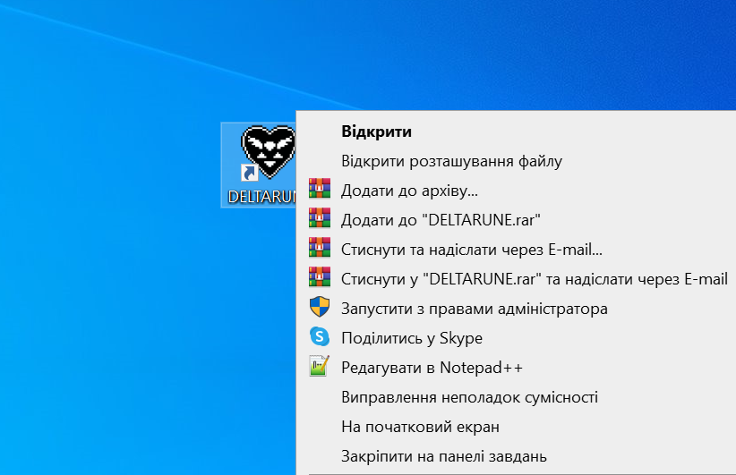
 
**4.** Перенесіть файли (`data` та теку `lang`) із завантаженого архіву просто до теки гри (На Linux - в папку “assets”), та **ОБОВ'ЯЗКОВО** погодьтесь із заміною!
 
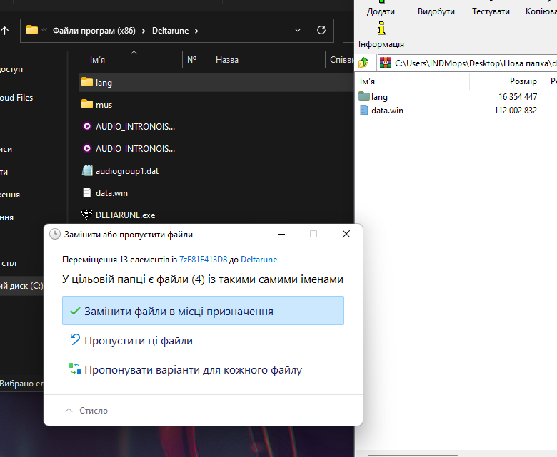
 
**5.** Тепер зайдіть до гри та серед наявних мов виберіть українську. Готово! Приємної гри!

## Android
**1.** Перейдіть до розділу “[Посилання](https://github.com/yanchukcha/deltarune-ua#Посилання)” -> “[Завантаження мода](https://github.com/yanchukcha/deltarune-ua#Завантаження-мода)” та виберіть зручний для себе спосіб завантаження моду, а потім — останню версію локалізації, яка є зараз.
  
**2.** Завантажте та встановіть “Deltarune-UA_Android.apk”. У разі крашів спробуйте встановити “Deltarune-UA_Android_Shaderless.apk”, НЕ видаляючи перед тим уже встановлену гру.
  
**3.** Тепер зайдіть до гри та серед наявних мов виберіть українську. Готово! Приємної гри!
  
**P.S.** Перед оновленням застосунку на нову версію, НЕ видаляйте стару, щоб не втратити свої збереження!

## Повідомлення про проблеми та питання:
Якщо у вас виникли якісь проблеми із встановленням, чи є якісь інші питання:
 
**1.** Зайдіть до вкладки “[Issues](https://github.com/yanchukcha/deltarune-ua/issues)” та натисніть “New issue”.
 
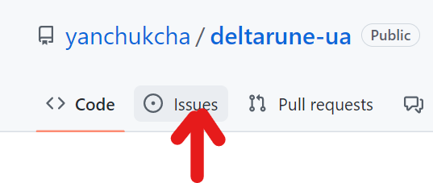
 
 

 
**2.** За допомогою готового шаблону з інструкціями [створіть](https://github.com/yanchukcha/deltarune-ua/issues/new/choose) нове повідомлення про проблему та/або знайдену помилку в перекладі, натиснувши “Get started”
 
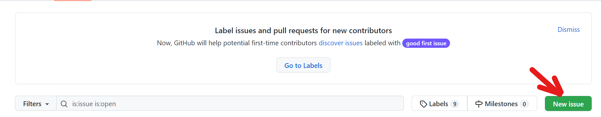
 
**3.** Для завершення натисніть на “Submit new issue”, щоб підтвердити створення свого повідомлення. Готово!  

Також ви можете особисто звернутися до [yanchukcha](https://discordapp.com/users/366303194688782336) або [danielle](https://discordapp.com/users/625325289656025089) у Discord, чи створити новий допис в каналі “#баґи-та-критика” на самому [сервері](https://discord.gg/uBMDfeMDJ3). 

# Посилання

### Завантаження мода
[Github](https://github.com/yanchukcha/deltarune-ua/releases)
  [Google Диск](https://drive.google.com/drive/folders/1ddDw02e9ku1zThp_Ia6moOhIsqJEMlbt?usp=sharing)
  [Nexusmods](https://www.nexusmods.com/deltarune/mods/8?tab=files) 

### Ми в соцмережах
[YouTube](https://www.youtube.com/@pereclaw)
  [Telegram](https://t.me/pereclawteam)
  [Discord](https://discord.gg/K8bcdcY6Td)
  [Сервер DR/UT Україна (Discord)](https://discord.gg/uBMDfeMDJ3)

# Новини та оголошення
Перший та другий розділ закінчено, але досі радимо лишати відгуки щодо перекладу! Внести в нього зміни потребує мінімальних зусиль, тому не соромтеся.
  **Якщо вам цікаво, є записи проходження перекладу 1-го та 2-го розділів українськими стрімерами та нумограйниками (летсплеєрами), які ви можете переглянути за цими посиланнями:**

### YouTube
[Записи стримів](https://www.youtube.com/playlist?list=PLIoSWbHAMmkG7FvEuv_QZ13CTOCwt-7Ii)

[Нумограї](https://www.youtube.com/playlist?list=PLIoSWbHAMmkFPrPCSkhMzMh5xzLR5ewY8)

# Автори

## Перекладацька спілка “Pereclaw”

        
        
        

### Основні перекладачі:
- yanchukcha: [Discord](https://discordapp.com/users/366303194688782336)
- DanielleTlumach
- IOLEKS

### Інші перекладачі:
- Семен Згущений
- Paralvion
- pita_guy

### Організаторка:
- DanielleTlumach: [Discord](https://discordapp.com/users/625325289656025089), [Steam](https://steamcommunity.com/id/DanielleRocz/), [Twitch](https://www.twitch.tv/danielletlumach)

### Озвучення Джиявола:
- LostHuman — [Youtube](https://www.youtube.com/c/WildGamer111) (Голос)
- yanchukcha (Обробка)
- DanielleTlumach (Режисерування)

### Озвучення Спамтона:
- nini — [Youtube](https://www.youtube.com/@reiiini) та AevilJ — [Youtube](https://www.youtube.com/@AevilJ) (Інструментал)
- Ілля Янчицький (Голос)
- yanchukcha (Обробка)
- yanchukcha та Roavello (Міксування)
- DanielleTlumach (Режисерування)

### Другорядне озвучення:
- Ілля Янчицький (“В БІЙ!”)
- Мар'яна Янкевич (“РАУНД X!”)
- TTS Олена (Диспетчерка)
- FL Studio TTS (Кнопки літер)

### Don't Forget — “Не забудь” (Вокальний уривок):
- FulminisIctus — [Youtube](https://www.youtube.com/c/FulminisIctus) (Інструментал)
- neonbonbon — [Twitch](https://www.twitch.tv/neonbonbon?sr=a) (Вокал)
- yanchukcha (Обробка)
- DanielleTlumach (Режисерування)

### Until Next Time — “До зустрічі”
- AlexGamingSW (Інструментал)
- neonbonbon (Вокал)
- Napthablook та yanchukcha (Міксування)

### Інші редактори та помічники:
- [Florentia Mysteria](https://github.com/florik-florentia) (Ранні версії перекладу + Редактор)
- [INDMops](https://github.com/IndiMops) (Помічник)
- Ростік (Натхнення)
- Яйойщик

### Тестувальники:
- INDMops (1 розділ)
- TheBigOneUA (1&2 розділи) 

### Розробники порта для Android:
- https://angelapuzzle.wixsite.com/dt-port
